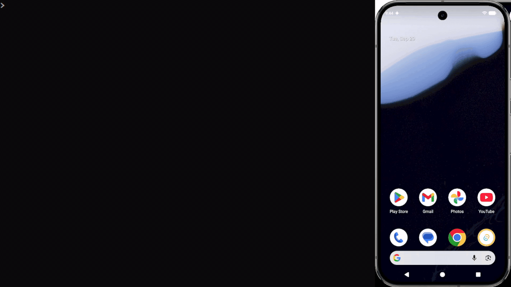
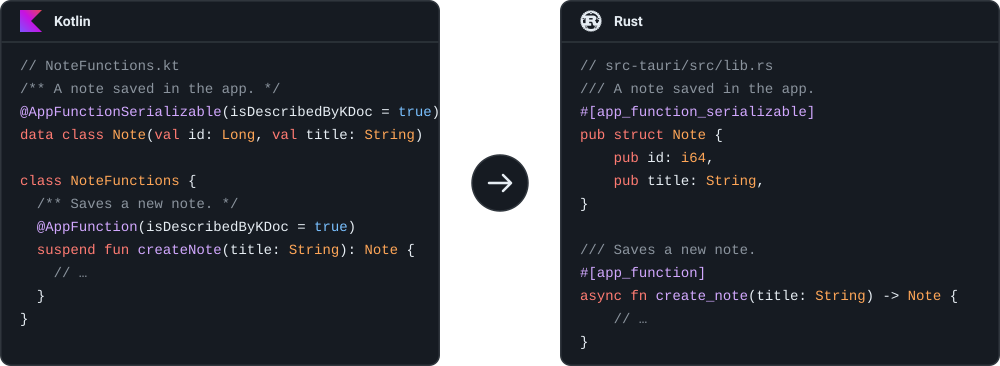
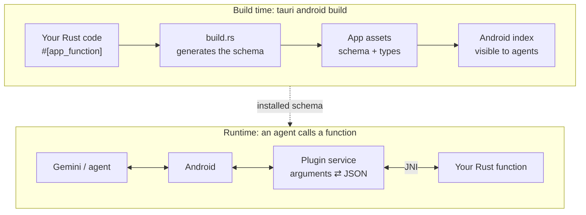

<p align="center">
  
</p>

<h1 align="center">tauri-plugin-google-app-functions</h1>

<p align="center">
  <b>Let Gemini and other Android agents call your Tauri app's Rust functions.</b><br>
  Write the function once in Rust. No Kotlin, no KSP, no Gradle changes.
</p>

<p align="center">
  
  
  
  
</p>

<p align="center">
  
  <br>
  <sub>An agent's calls, simulated over <code>adb</code>, reach the Rust functions of
  <a href="examples/tauri-app">the Tauri Todo example</a>: the task shows up on the phone right away.</sub>
</p>

> [!WARNING]
> **Experimental.** Android [AppFunctions](https://developer.android.com/ai/appfunctions) is a
> new platform feature, and its Jetpack library is still in alpha. Before you ship:
>
> - Whether **Gemini** calls functions of your app is decided by Google and differs by device,
>   region and Gemini version. See [Compatibility](#compatibility).
> - This plugin is `0.x`: function IDs, generated files and APIs may change between releases.

## Contents

- [What you get](#what-you-get)
- [Quick start](#quick-start)
- [Compatibility](#compatibility)
- [Writing app functions](#writing-app-functions)
- [Testing](#testing)
- [Troubleshooting](#troubleshooting)
- [How it works](#how-it-works)

## What you get

<p align="center">
  
</p>

- **Rust only.** Mark a function with `#[app_function]`, and Android indexes it as an app function
  that agents can discover and call.
- **Docs become the prompt.** Doc comments turn into the descriptions agents read to decide when
  to call your function and with which arguments.
- **Works with the app closed.** Android starts the plugin's service in the background; the
  Rust function runs without opening the UI.
- **Typed end to end.** Primitives, strings, optionals, lists and your own structs, with errors
  mapped to the standard AppFunctions error codes.

## Quick start

**1. Add the crates** to `src-tauri/Cargo.toml`:

```toml
[dependencies]
tauri-plugin-google-app-functions = "0.1"

[build-dependencies]
tauri-plugin-google-app-functions-build = "0.1"
```

**2. Generate the schema** in `src-tauri/build.rs`:

```rust
fn main() {
    tauri_build::build();
    tauri_plugin_google_app_functions_build::Builder::new()
        // Optional, but it helps agents a lot: what the app is for and when to use which function.
        .app_description("A note-taking app. Use `createNote` to save a note.")
        .build();
}
```

**3. Register the plugin and write a function** in `src-tauri/src/lib.rs`:

```rust
use tauri::AppHandle;
use tauri_plugin_google_app_functions::{app_function, app_function_serializable, AppFunctionError};

/// A note saved in the app.
#[app_function_serializable]
pub struct Note {
    /// Unique identifier of the note.
    pub id: i64,
    /// Short title shown in the note list.
    pub title: String,
    /// Full note text, if any.
    pub content: Option<String>,
}

/// Saves a new note.
///
/// # Arguments
/// * `title` - Title of the note. Must not be empty.
/// * `content` - Optional body text.
///
/// # Returns
/// The saved note with its assigned ID.
#[app_function]
async fn create_note(
    app: AppHandle,
    title: String,
    content: Option<String>,
) -> Result<Note, AppFunctionError> {
    // ...
}

pub fn run() {
    tauri::Builder::default()
        .plugin(tauri_plugin_google_app_functions::init())
        // ...
}
```

Build with the Tauri CLI as usual (`tauri android dev` or `tauri android build`). On the device,
the function shows up as `com.plugin.google_app_functions.TauriAppFunctionService#createNote`.

That's all: the Android project from `tauri android init` stays untouched. See
[examples/tauri-app](examples/tauri-app), a todo list Gemini can add tasks to, for a complete
app.

## Compatibility

### Devices

| Android version                     | Status                                                                                                                           |
| ----------------------------------- | -------------------------------------------------------------------------------------------------------------------------------- |
| Android 17 (API 37)                 | ✅ Functions are indexed and callable. Tested on the API 37 emulator.                                                            |
| Android 16 (API 36), current builds | ✅ Expected to work: the same system API.                                                                                        |
| Android 16, early release builds    | ❌ The system does not index the functions. Seen on the first API 36 emulator image (`BE2A.250530`); update the device or image. |
| Android 15 and older                | ➖ The app works normally; the functions are not exposed.                                                                        |
| iOS, desktop                        | ➖ The plugin does nothing; `invoke` still works for [tests](#testing).                                                          |

### Callers

| Caller                       | Status                                                                                                                               |
| ---------------------------- | ------------------------------------------------------------------------------------------------------------------------------------ |
| `adb shell cmd app_function` | ✅ Tested: every supported type, error code and background start.                                                                    |
| Gemini                       | ⚠️ Up to Google. Gemini calls app functions only in the apps and regions where Google has enabled it, and this is still rolling out. |
| Other on-device agents       | ⚠️ Should work: they use the same system API. Not tested.                                                                            |

### Toolchain

| Requirement                        | Version                                                              |
| ---------------------------------- | -------------------------------------------------------------------- |
| Tauri                              | 2.12+                                                                |
| Rust                               | 1.90+                                                                |
| Android `minSdk`                   | 24+ (the plugin is inactive below API 36)                            |
| Android `compileSdk` / `targetSdk` | 37, the default in the Tauri 2.12 template                           |
| Build                              | Through the Tauri CLI; a plain `cargo build` skips the Android files |

## Writing app functions

`#[app_function]` works on free functions, sync or `async`.

### Supported types

| Rust                                       | AppFunctions type                                   |
| ------------------------------------------ | --------------------------------------------------- |
| `bool`                                     | boolean                                             |
| `i8`, `i16`, `i32`, `u8`, `u16`            | int                                                 |
| `i64`, `u32`, `u64`, `isize`, `usize`      | long                                                |
| `f32` / `f64`                              | float / double                                      |
| `String`                                   | string                                              |
| `Option<T>`                                | nullable `T`; an optional parameter is not required |
| `Vec<T>`                                   | array of `T`                                        |
| struct with `#[app_function_serializable]` | object                                              |
| `()` (return type only)                    | unit                                                |

**Not supported yet:** enums, maps, tuples, byte arrays, dates and times, URIs, generic or tuple
structs, `Vec<Option<T>>` and `Option<Option<T>>`. Using one fails the build with a message
that names the parameter.

### Rules

- **Names.** `snake_case` becomes `camelCase` for functions, parameters and fields:
  `create_note` is `createNote` to agents.
- **The app handle.** A `tauri::AppHandle` parameter is filled in by the plugin and hidden from
  agents. Use it to reach managed state with `app.state::<T>()`. It exists only while the app is
  open: when Android starts the function in the background, such a function fails with
  _"the app is not running"_. Functions without it always work.
- **Errors.** Return `Result<T, E>` with `E: Into<AppFunctionError>`. Each variant maps to an
  AppFunctions error code: `InvalidArgument`, `ElementNotFound`, `ElementAlreadyExists`,
  `PermissionRequired`, `NotSupported`, `Disabled`, `LimitExceeded`, `Cancelled`, `Unknown`.
  `String`, `&str` and `tauri::Error` convert to `Unknown`. A panic is reported as `Unknown`
  and does not crash the app.
- **Descriptions.** Agents only see your doc comments, so write them for an LLM:
  - the first paragraph says what the function does;
  - parameters go in a `# Arguments` section, as ``* `name` - description`` bullets;
  - the return value goes in a `# Returns` section;
  - struct and field docs describe objects and their properties.
- **Structs.** `#[app_function_serializable]` derives serde's `Serialize` and `Deserialize` with
  `rename_all = "camelCase"`. Don't derive serde yourself or add serde renames: the schema
  generator would not see them.
- **Unique names.** Function and struct names must be unique across the crate, including
  items behind `cfg`.
- **Cancellation.** If the agent cancels a call, the Rust function still runs to the end; the
  system just drops its result.

## Testing

**Without a device.** Call a registered function by its Rust name with the same JSON Android
sends:

```rust
let note = tauri_plugin_google_app_functions::invoke(
    "create_note",
    serde_json::json!({ "title": "Groceries", "content": null }),
).await?;
```

**On a device or emulator** (Android 16+):

```sh
# Is the app indexed?
adb shell cmd app_function list-app-functions | grep -A2 com.example.app

# Call a function
adb shell "cmd app_function execute-app-function --package com.example.app \
  --function 'com.plugin.google_app_functions.TauriAppFunctionService#createNote' \
  --parameters '{\"title\": \"Groceries\"}'"
```

[examples/tauri-app/test-app-functions.sh](examples/tauri-app/test-app-functions.sh) calls every
function of the example app, with the app both closed and open (build the example with
`--features test-functions` first).

**With Gemini.** Name the app and the action: _"Add buy milk to my list in Tauri Todo"_.
If Gemini answers on its own instead, first check that `adb` can call the function; if it can,
see the Gemini row in [Compatibility](#compatibility).

## Troubleshooting

| Symptom                                               | Cause and fix                                                                                                                                                                                                        |
| ----------------------------------------------------- | -------------------------------------------------------------------------------------------------------------------------------------------------------------------------------------------------------------------- |
| The app is missing from `list-app-functions`          | Check `adb logcat \| grep AppSearchAppsUtil` after installing. A `NameNotFoundException` there means an early Android 16 build: update the device or emulator image. Also make sure you built through the Tauri CLI. |
| `cmd app_function`: _No shell command implementation_ | Early Android 16 build without the shell commands. Use a newer image.                                                                                                                                                |
| _the app is not running; open it and retry_           | The function takes an `AppHandle`, and the app is closed. Open the app, or drop the parameter.                                                                                                                       |
| `INSTALL_FAILED_INSUFFICIENT_STORAGE`                 | Debug builds include large Rust debug info. Give the emulator more storage, or add `[profile.dev] debug = "line-tables-only"` to `Cargo.toml`.                                                                       |
| Gemini does not call the function                     | See [Compatibility](#compatibility). Clear descriptions and an `app_description` help Gemini choose your function.                                                                                                   |

## How it works



1. `#[app_function]` registers the function in a registry, keyed by its Rust name.
2. `tauri-plugin-google-app-functions-build` scans `src/` from `build.rs` and writes into the
   Android app module, under `app/src/main/assets/generated/` (git-ignored by the Tauri template):
   - `tauri_app_functions.xml`: the schema Android indexes, in the format the official
     `androidx.appfunctions` compiler produces;
   - `tauri_app_functions.json`: the parameter and result types of each function.
3. The plugin's manifest registers `TauriAppFunctionService` with that schema, and the plugin's
   Gradle script makes the app package these files after the Rust build.
4. On a call, the service converts the arguments to JSON, runs the Rust function on Tauri's
   async runtime and converts the result or error back.

## License

[MIT](LICENSE)

---

<sub>Tauri and Gemini names and logos are trademarks of their respective owners. This project is
not affiliated with or endorsed by Google or the Tauri Programme.</sub>
